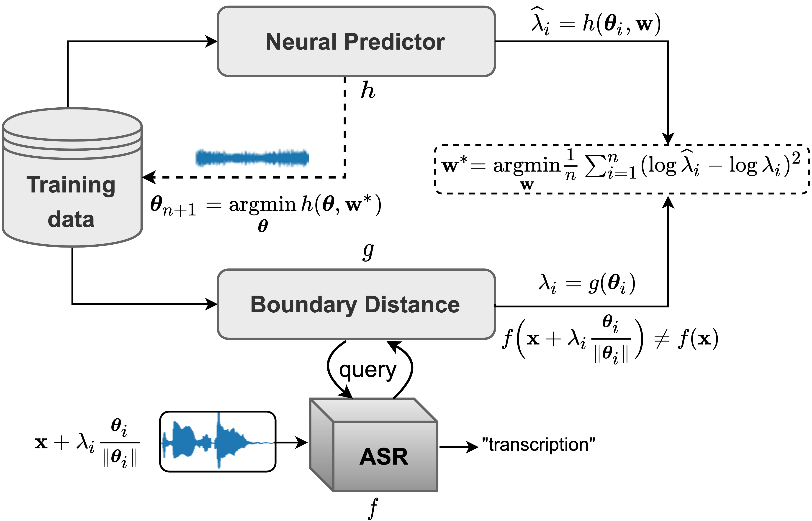

# NP-Attack: Neural Predictor for Black-Box Adversarial Attacks on Speech Recognition

[](https://www.python.org/downloads/release/python-380/)
[](https://opensource.org/licenses/MIT)
[](https://arxiv.org/abs/2203.09849)

## Abstract

Recent works have revealed the vulnerability of automatic speech recognition (ASR) models to adversarial examples (AEs), *i.e.*, small perturbations that cause an error in the transcription of the audio signal. Studying audio adversarial attacks is the first step towards robust ASR. Despite the significant progress made in attacking audio examples, the black-box attack remains challenging because only the hard-label information of transcriptions is provided. Due to this limited information, existing black-box methods often require an excessive number of queries to attack a single audio example. In this paper, we introduce NP-Attack, a neural predictor-based method, which progressively evolves the search towards the small adversarial perturbation. Given a perturbation direction, our neural predictor directly estimates the smallest perturbation that causes a mistranscription. In doing so, NP-Attack accurately learns promising perturbation directions of the AE via gradient-based optimization. Experimental results show that NP-Attack achieves competitive results with other state-of-the-art black-box adversarial attacks while requiring a significantly smaller number of queries.



## Requirements

```python
pip install -r requirements.txt
```

## Usage

To run the NP-attack, either modify `conf/config.yaml` directly, or via command line:

```python
python main.py [wave_file=<wave_file>] [budget=<budget>] [eps_perb=<eps_perb>]
```

For more information, refer to [Hydra documentation](https://hydra.cc/docs/intro/). 

## Data

The LibriSpeech test-clean dataset can be downloaded:

```
wget https://www.openslr.org/resources/12/test-clean.tar.gz
tar -xzvf test-clean.tar.gz
```

The list of samples used for benchmarking can be found in `data/benchmark.txt`.

## Reference

```
@article{biolkova2022npattack,
  title={Neural Predictor for Black-Box Adversarial Attacks on Speech Recognition},
  author={Biolková Marie and Nguyen Bac},
  journal={arXiv preprint arXiv:2203.09849},
  year={2022}
}
```
